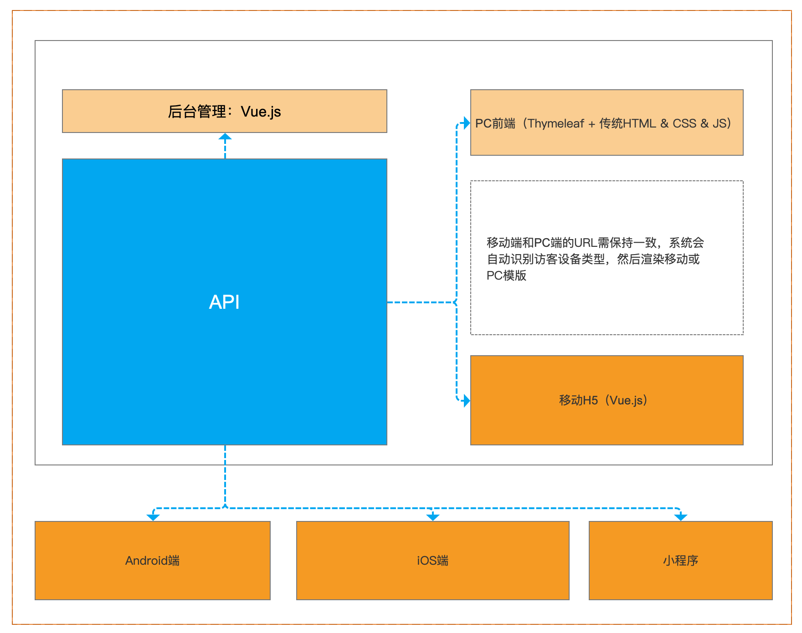

一个CMS和后端Api系统，基于Java Springboot，且拥有标准的ACL权限控制。本人为了做项目方便，就特意搞了这个东西，用来二次开发，还是挺方便的。

本人会逐渐提供完整、详细的文档资料和接口资料。

##### 主要涉及到的技术：

1、MySQL 8.0

2、SpringBoot 2

3、Open Jdk 8

4、Docker

**拥有的特性：**

1、拥有完整的ACL访问控制模块；

2、图片可以保存在服务器本地，也可以选择保存在七牛云；

3、上传保存在本地的图片也支持自动生成缩略图（仿七牛云）；

4、可docker-compose一键启动，已配置好nginx文件，支持ssl，只要修改绑定域名和证书文件即可；

##### 服务器可选使用的部署运维方案：

1、docker-compose一键启动【配合Docker HEALTHCHECK 、Docker autoheal，由docker-compose编排，含Nginx和SSL】，该方案便宜、方便，可单机部署【新手推荐】；

2、k8s部署（高可靠、弹性可扩展）

##### 技术架构图：

