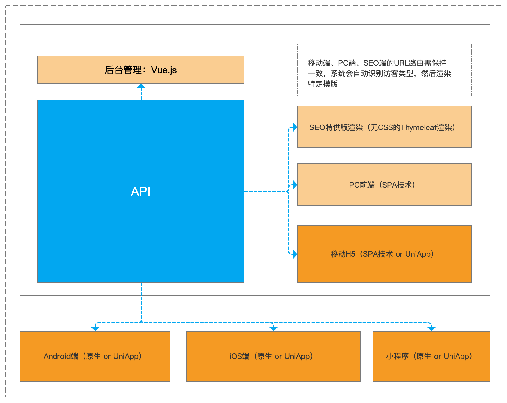

一个CMS和后端Api系统，基于Java Springboot，且拥有标准的ACL权限控制。本人为了做项目方便，就特意搞了这个东西，用来二次开发，方便实用。

后续还会不断加入：电商模块、直播模块、AI内容辨别模块，敬请期待。


**^_^**

**基于本项目做二开，只需配备一位Java工程师和一位前端工程师，在成本和效率上可媲美”世界上最好的语言“。**


#### 二次开发：

1、Vue-Element-Admin后台源码：https://github.com/soyojoearth/nxtframework_admin

2、Api接口文档：请clone项目后打开 document/nxtframework_api.html

3、数据库文档：请clone项目后打开 document/数据库结构.docx


#### Demo：

1、地址：https://demo.nxtframework.com/admin 

2、用户名：guest 密码：fxxkyou1314 （访客权限，只能看，不能改）


#### 主要涉及到的技术：

1、MySQL 8.0

2、SpringBoot 2

3、Open Jdk 8

4、Docker


#### **拥有的特性：**

1、拥有完整的ACL访问控制模块；

2、图片可以保存在服务器本地，也可以选择保存在七牛云；

3、上传保存在本地的图片也支持自动生成缩略图（仿七牛云）；

4、前后端分离，且提供“搜索引擎SEO特供版渲染”；

5、可docker-compose一键启动，已配置好nginx文件，支持ssl，只要修改绑定域名和证书文件即可；

6、具备Docker HEALTHCHECK 、Docker autoheal，自动检测健康状态，发现故障自动重启；


#### 技术架构图：




#### 单机部署方式：

**1、clone项目，用docker创建数据库镜像：**

```
git clone https://github.com/soyojoearth/nxtframework.git
cd nxtframework/wwwroot/db/
#创建、启动docker数据库（仅供测试）
docker build --tag nxtmysql:0.1.0 .
#回到项目目录
cd ../../
```

**2、到项目根目录，执行：**


```
#打包
mvn package -Dmaven.test.skip=true
#创建镜像
docker build --tag nxtframework:0.1.0 .
#启动本地测试
cd wwwroot
docker-compose -f docker-compose-quickstart-with-db.yml up
```

**3、然后浏览器打开：`http://127.0.0.1:8686/admin`  用户名：`admin` 密码：`12345678`**

**4、如何启用80端口、部署SSL：**

添加以下hosts

`127.0.0.1  test.nxtframework.com`

打开浏览器访问：http://test.nxtframework.com/admin 和 https://test.nxtframework.com/admin

**5、如何更换域名、证书：**

修改`wwwroot/http/nginx.conf`文件，将域名修改成自己的域名；

更换`wwwroot/http/ssl*` 两个证书文件；

**6、其它**

一般不建议用docker部署mysql，正式商用时，还请使用独立的mysql数据库，使用 `docker-compose-quickstart.yml` 启动应用


#### 集群部署方式：

1、使用k8s部署；

2、完。